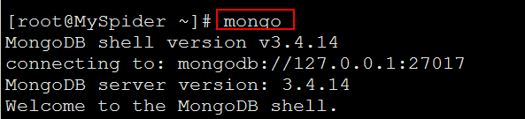
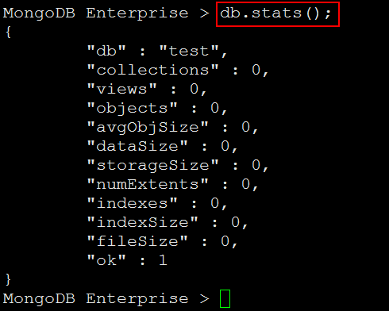

# 安装Mongodb数据库 #

[Linux平台安装MongoDB](http://www.runoob.com/mongodb/mongodb-linux-install.html)

## 安装Mongodb ##

下载完安装包，并解压 tgz

	[root@MySpider ~]# tar -zxvf mongodb-linux-x86_64-enterprise-rhel62-3.4.14.tgz
	
	[root@MySpider ~]# mv mongodb-linux-x86_64-enterprise-rhel62-3.4.14 /usr/local/mongodb

MongoDB 的可执行文件位于 `bin` 目录下，所以可以将其添加到 `PATH` 路径中：

	[root@MySpider ~]# vi /etc/profile

内容如下：

	export PATH=/usr/local/mongodb/bin:$PATH

重回加载配置文件`/etc/profile`

	[root@MySpider ~]# source /etc/profile

## 创建数据库目录 ##

MongoDB的数据存储在data目录的db目录下，但是这个目录在安装过程不会自动创建，所以你需要手动创建data目录，并在data目录中创建db目录。

	[root@MySpider ~]# mkdir -p /data/db

## 启动Mongodb服务端 ##

在mongodb的bin目录下执行`mongod`命令来启动mongdb服务。

## 启动Mongodb Shell客户端 ##

启动Shell客户端：

	mongo

查看当前使用的数据库：

	db.stats();

