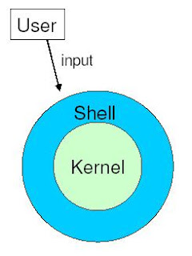
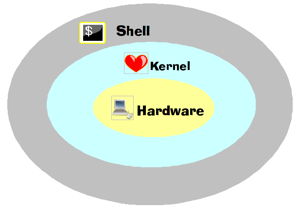
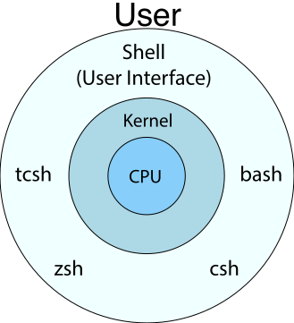

# Shell And Kernel

URL：

- https://cvw.cac.cornell.edu/linux/howwork

There are two major components of Linux, **the kernel** and **the shell**. **The kernel** is the core of the Linux operating system which schedules processes and interfaces directly with the hardware. It manages system and user I/O, processes, devices, files, and memory. **The shell** is an interface to the kernel. Users input commands through the shell, and the kernel receives the tasks from the shell and performs them. The shell tends to do four jobs repeatedly: display a prompt, read a command, process the given command, then execute the command. After which it starts the process all over again.

> 这段理解的几个意思：  
> （1）Linux由kernal和shell两个主要部分组成。  
> （2）kernel主要负责与“非人”的事物打交道，例如：抽象概念（进程、文件）和硬件（CPU、内存、IO设备）。  
> （3）shell是“人”与kernel之间桥梁，接收用户的输入，然后交给kernel处理；kernel处理完成后，把结果返回给shell，由shell呈现给用户。

**Shell** is basically Bridge between **kernel** and **the user**, **a Command Interpreter** where user can type command and the command is conveyed to the kernel and it will be executed. 

> 这个图展示了“用户”、“Shell”、“Kernel”三者之间的关系。

> 这个图展示了Shell、Kernel和Hardware三者之间的关系。Hardware就像是一个人的身体。Kernel就像一个人的心脏，没有这个Kernel“心脏”的话，整个机器就无法运转起来。如果没有Shell，Kernel和Hardware一起也能运行起来；那么，Shell存在的意义就是提供了一个与外界进行交互的接口。

Basically **the kernel** is the center of the operating system that manages everything. **The shell** is just a particular program, a friendly interface that translates your commands into some low-level calls to the kernel.

Kernel is “the Linux” itself. It’s a bunch of code that deals with networking, managing memory, talking to hardware devices such as disks, graphics cards, mouse, and so on. It also knows how the contents of a disk is organized in files, and how to open files and read/write data into them. However from user’s perspective, kernel is silent and invisible. It just sits there and does nothing useful by itself. Its sole purpose is to provide the “magic” where programs can run and interact with each other and the hardware. The Linux kernel was initially written by Linus Torvalds.

A shell, on the other hand, is a program that you use to interact with a computer by typing commands.Shell reads your commands and executes them one after another. For example, if you type “cp file1 file2”, shell understands that you want to copy a file. On your behalf, it then calls one or more kernel functions to create file2, open file1 for reading, read chunks of data from it, write chunks of data to file2, and finally to close both files. Similarly, ff you type “rm file3”, shell will call one or more kernel functions to do that, and so on. If something goes wrong (file not found etc.), shell will print the error. A shell is also used to start other programs. If you type a command that shell itself doesn’t understand, it will search a list of predetermined directories ($PATH) and try to find a program with that name. Instead of typing commands over and over, you can also write them into a file (called a shell script), and the shell will treat them as new programs/commands.

In a running Linux system, there is always exactly one running kernel. But you can have zero, one or more shells running in parallel. There are many different shells, such as bash, zsh, ksh and so on, each with its own strengths and weaknesses. As far as I know, bash is the most popular. You can learn more about it if you type “man bash”.

> 这张图显示了在Kernel之上存在不同的shell类型，用户通过选择其中的某一种Shell来与Kernel进行交互。

