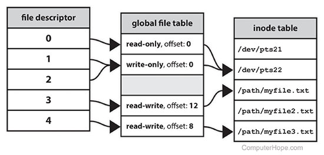

# File Descriptor

**A file descriptor** is **a number** that uniquely identifies an open file in a computer's operating system. It describes a data resource, and how that resource may be accessed.

> 是什么，即what: file descriptor的本质就是一个number，它的**用途**就是唯一的标识一个打开的文件。


When a program asks to open a file — or another data resource, like a network socket — **the kernel of the operating system** grants access, makes an entry in the **global file table**, and provides the software with the location of that entry.

> 它既然是一个数，那么是如何生成呢？（一个人，是从哪儿来，到哪儿去……）  
> 如何生成：file descriptor是由系统内核(the kernel of the operating system)分配的，并维护在global file table中。

**The descriptor** is identified by **a unique non-negative integer**, such as 0, 12, or 567. At least one file descriptor exists for every open file on the system.

> 取值范围的限定：file descriptor是一个非负的整数

**File descriptors** were first used in Unix, and are used by modern operating systems including Linux, macOS X, and BSD. In Microsoft Windows, file descriptors are known as file handles.

> 起源于，流行于：file decriptor最初是Unix先使用的，后来用于Linux和maxOS等。

When **a process** makes a successful request to **open a file**, **the kernel** returns **a file descriptor** which points to an entry in the kernel's **global file table**. **The file table entry** contains information such as **the inode of the file**, **byte offset**, and **the access restrictions** for that data stream (read-only, write-only, etc.).

> 描述了一个过程：file descriptor的产生过程



## Stdin, stdout, and stderr
On a Unix-like operating system, the first three file descriptors, by default, are `STDIN` (standard input), `STDOUT` (standard output), and `STDERR` (standard error).


| Name            | File descriptor | Descripton                                                   | Abbrevation |
| --------------- | --------------- | ------------------------------------------------------------ | ----------- |
| Standard input  | 0               | The default data stream for input, for example in a command pipeline. In the [terminal](https://www.computerhope.com/jargon/t/terminal.htm), this defaults to keyboard input from the user. | **stdin**   |
| Standard output | 1               | The default data stream for output, for example when a command prints text. In the terminal, this defaults to the user's screen. | **stdout**  |
| Standard error  | 2               | The default data stream for output that relates to an error occurring. In the terminal, this defaults to the user's screen. | **stderr**  |

## Redirecting file descriptors

**File descriptors** may be directly accessed using `bash`, **the default shell** of Linux, macOS X, and Windows Subsystem for Linux.

For example, when you use the `find` command, successful output goes to `stdout` (file descriptor 1), and error messages go to `stderr` (file descriptor 2). Both streams display as terminal output:

```bash
find / -name '*something*'
```
```
/usr/share/doc/something
/usr/share/doc/something/examples/something_random
find: `/run/udisks2': Permission denied
find: `/run/wpa_supplicant': Permission denied
/usr/share/something
/usr/games/something
```

We're getting errors because `find` is trying to search a few system directories that we don't have permission to read. All the lines that say "Permission denied" were written to `stderr`, and the other lines were written to `stdout`.

You can hide `stderr` by redirecting file descriptor 2 to `/dev/null`, the special device in Linux that "goes nowhere":

```bash
find / -name '*something*' 2>/dev/null
```

```
/usr/share/doc/something
/usr/share/doc/something/examples/something_random
/usr/share/something
/usr/games/something
```

The errors have been sent to `/dev/null`, and are not displayed.

Understanding the difference between `stdout` and `stderr` is important when you want to work with a program's output. For example, if you try to `grep` the output of the `find` command, you'll notice that the error messages are not filtered, because only the standard output is piped to `grep`.

```bash
find / -name '*something*' | grep 'something'
```

```
/usr/share/doc/something
/usr/share/doc/something/examples/something_random
find: `/run/udisks2': Permission denied
find: `/run/wpa_supplicant': Permission denied
/usr/share/something
/usr/games/something
```

However, you can redirect **standard error** to **standard output**, and then `grep` will process the text of both:

```bash
find / -name '*something*' 2>&1 | grep 'something'
```

```
/usr/share/doc/something
/usr/share/doc/something/examples/something_random
/usr/share/something
/usr/games/something
```

Notice that in the command above, the **target file descriptor (1)** is prefixed with an **ampersand** ("`&`"). 

