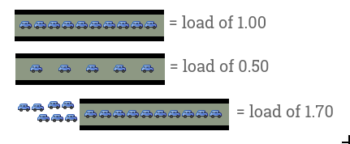

# Understanding Linux CPU Load - when should you be worried?

URL: http://blog.scoutapp.com/articles/2009/07/31/understanding-load-averages

You might be familiar with Linux **load averages** already. Load averages are the three numbers shown with the `uptime` commands - they look like this:

> Linux系统的负载，可以通过uptime来进行查看。

```txt
load average: 0.09, 0.05, 0.01
```

Most people have an inkling of **what the load averages mean**: the three numbers represent averages over progressively longer periods of time (one, five, and fifteen minute averages), and that lower numbers are better. **Higher numbers represent a problem or an overloaded machine**. 

> 从浅显的角度来说，值越大，负载越高。

But, **what's the the threshold?** What constitutes "good" and "bad" load average values? When should you be concerned over a load average value, and when should you scramble(争夺；争抢) to fix it ASAP?

> 这段其实就是讲一个“定量”的问题：那个阈值到底是多少？     
> asap(=as soon as possible)尽快地；立刻


First, a little background on **what the load average values mean**. We'll start out with the simplest case: **a machine with one single-core processor**.

> 负载到底是什么呢？下文以一个只有一个core的计算机来进行说明。


## The traffic analogy

A single-core CPU is like a single lane(小路；通道) of traffic. Imagine you are a bridge operator(操作人员) ... sometimes your bridge is so busy there are cars lined up to cross. You want to let folks know how traffic is moving on your bridge. A decent metric would be how many cars are waiting at a particular time. If no cars are waiting, incoming drivers know they can drive across right away. If cars are backed up(后备；排队), drivers know they're in for delays.

> 要以一种“定量”的形式来具体的表达这种“拥堵”的情况。

So, Bridge Operator, what numbering system are you going to use? How about:

- **0.00 means there's no traffic on the bridge at all**. In fact, between 0.00 and 1.00 means there's no backup, and an arriving car will just go right on.
- **1.00 means the bridge is exactly at capacity**. All is still good, but if traffic gets a little heavier, things are going to slow down.
- **over 1.00 means there's backup**. How much? Well, 2.00 means that there are two lanes worth of cars total -- one lane's worth on the bridge, and one lane's worth waiting. 3.00 means there are three lane's worth total -- one lane's worth on the bridge, and two lanes' worth waiting. Etc.



This is basically **what CPU load is**. "Cars" are processes using a slice of CPU time ("crossing the bridge") or queued up to use the CPU. Unix refers to this as the **run-queue length**: **the sum of the number of processes** that are currently running plus **the number** that are waiting (queued) to run.

> CPU负载的本质：正在运行的process的数量 加上 等待运行的process数量。

Like the bridge operator, you'd like your cars/processes to never be waiting. So, your CPU load should ideally stay below 1.00. Also like the bridge operator, you are still ok if you get some temporary spikes above 1.00 ... but when you're consistently above 1.00, you need to worry.

> 理想的情况下，CPU load应该小于1.00；如果临时的超过1.00，也没有什么大事儿；如果经常性的高于1.00，那么就需要开始担心了。

## So you're saying the ideal load is 1.00?

Well, not exactly. The problem with a load of 1.00 is that you have no headroom(余量；动态余量). In practice, many sysadmins will draw a line at **0.70**:

> 从“理想”到“现实”，由1.00变为0.70。

- The "**Need to Look into it**" Rule of Thumb: **0.70** If your load average is staying above `> 0.70`, it's time to investigate before things get worse.

- The "**Fix this now**" Rule of Thumb: **1.00**. If your load average stays above 1.00, find the problem and fix it now. Otherwise, you're going to get woken up in the middle of the night, and it's not going to be fun.

- The "**Arrgh, it's 3AM WTF?**" Rule of Thumb: **5.0**. If your load average is above 5.00, you could be in serious trouble, your box is either hanging or slowing way down, and this will (inexplicably) happen in the worst possible time like in the middle of the night or when you're presenting at a conference. Don't let it get there.

## What about Multi-processors? My load says 3.00, but things are running fine!

Got a quad-processor(4个处理器) system? It's still healthy with a load of 3.00.

On multi-processor system, the load is relative to the number of processor cores available. The "100% utilization" mark is 1.00 on a single-core system, 2.00, on a dual-core, 4.00 on a quad-core, etc.

> 对于多处理器的系统，负载值是相对的。

If we go back to the bridge analogy, the "1.00" really means "one lane's worth of traffic". On a one-lane bridge, that means it's filled up. On a two-lane bridge, a load of 1.00 means its at 50% capacity -- only one lane is full, so there's another whole lane that can be filled.

> 大桥如此。

**Same with CPUs**: a load of 1.00 is 100% CPU utilization on single-core box. On a dual-core box, a load of 2.00 is 100% CPU utilization.

> CPU亦然。

## Multicore vs. multiprocessor

While we're on the topic, let's talk about multicore vs. multiprocessor. For performance purposes, is a machine with a single dual-core processor basically equivalent to a machine with two processors with one core each? Yes. Roughly. There are lots of subtleties here concerning amount of cache, frequency of process hand-offs(传递) between processors, etc. Despite those finer points, for the purposes of sizing up the CPU load value, **the total number of cores is what matters**, regardless of how many physical processors those cores are spread across.

> 对于multicore和multiprocessor，最重要的是core的数量。

Which leads us to a two new Rules of Thumb:

- The "**number of cores = max load**" Rule of Thumb: on a multicore system, your load should not exceed the number of cores available.

- The "**cores is cores**" Rule of Thumb: How the cores are spread out over CPUs doesn't matter. *Two quad-cores == four dual-cores == eight single-cores*. It's all eight cores for these purposes.


## Bringing It Home

Let's take a look at the load averages output from `uptime`:

```bash
$ uptime
23:05 up 14 days, 6:08, 7 users, load averages: 0.65 0.42 0.36
```

This is on a dual-core CPU, so we've got lots of headroom(余量). I won't even think about it until load gets and stays above 1.7 or so.

Now, what about those three numbers? 0.65 is the average over the last minute, 0.42 is the average over the last five minutes, and 0.36 is the average over the last 15 minutes. Which brings us to the question:

**Which average should I be observing? One, five, or 15 minute?**

For the numbers we've talked about (**1.00 = fix it now**, etc), **you should be looking at the five or 15-minute averages**. Frankly, if your box spikes above 1.0 on the one-minute average, you're still fine. It's when the 15-minute average goes north of 1.0 and stays there that you need to snap to. (obviously, as we've learned, adjust these numbers to the number of processor cores your system has).

**So number of cores is important to interpreting load averages** ... **how do I know how many cores my system has?**

`cat /proc/cpuinfo` to get info on each processor in your system. Note: not available on OSX, Google for alternatives. To get just a count, run it through `grep` and **word count**: `grep 'model name' /proc/cpuinfo | wc -l`


