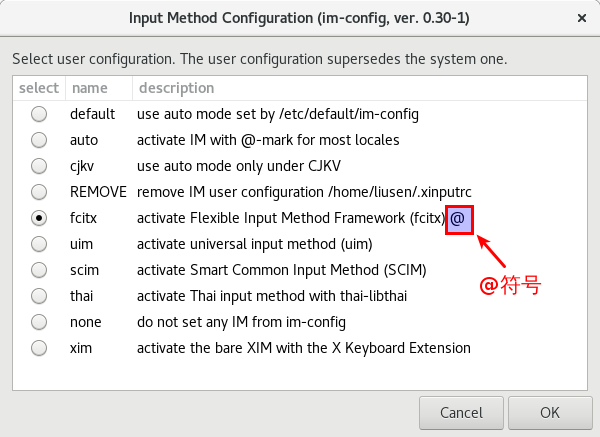

# Fcitx(Free Chinese Input Toy of X)

## Talk is Cheep

要换fictx输入法，先删除ibus输入法。

```bash
# 删除ibus输入法
sudo apt purge ibus
```

然后安装fcitx和拼音输入法（要安装搜狗就再另外装）。

```bash
# 安装input method framework: fcitx
sudo apt install fcitx
# 安装input method engine: fcitx-table-wbpy
sudo apt install fcitx-table-wbpy
```

然后设置fcitx为默认输入法

```bash
# 选择input method framework: fcitx
im-config
```

然后设置fictx输入法

```bash
# 选择input method engine: fcitx-table-wbpy
fcitx-config-gtk3
```

## Fcitx Intro

**Fcitx** `[ˈfaɪtɪks]` is an input method framework with extension support. Currently it supports **Linux** and **Unix** systems like freebsd.

**Fcitx** is a lightweight **input method framework** aimed at providing environment independent language support for Linux.

> 这里说Fcitx是一个input method framework，是一个框架，那与input method到底是怎么整合到一起的呢？

## Input method Framework and Engine

There are two concepts to know, **input method framework** and **input method engine**:

- An **input method framework** is designed to serve as a daemon and handle user input events, output the result to target applications or layers.
- An **input method engine** is a program to analyze inputed characters and calculate a list of probably results, then send the results to their hosted input method framework to complete the reaction with users and applications.

An **input method** (**IM**) is a way to input a certain set of characters and symbols, usually because a keyboard does not directly support them.

Most **input methods** are part of an **IM framework**, which lets the user easily switch between multiple input methods. These input methods are either included with the framework or packaged separately. **Programs** implementing **input methods** are called **IM engines**. The input methods available for a language are listed in the respective language subpage.

The available **IM frameworks** are:

- **Fcitx** — Input method framework with extension support.
- **gcin** — Input method server supporting various input methods.
- **Hime** — Universal input method platform.
- **IBus** — Intelligent Input Bus, a next generation input framework.
- **Nimf** — A multilingual input method framework which inherits Dasom.
- **SCIM** — The Smart Common Input Method platform.
- **uim** — Multilingual input method framework to provide simple, easily extensible and high code-quality input method development platform, and useful input method environment for users of desktop and embedded platforms.

## Fcitx Input method engines

**Fcitx** provides **built-in input methods** for Chinese Pinyin and table-based input (for example Wubi).

**Chinese**

- **fcitx-sunpinyin**, based on sunpinyin. It strikes a good balance between speed and accuracy.
- **fcitx-googlepinyin**, the Google pinyin IME for Android.
- **fcitx-cloudpinyin** uses internet sources to provide input candidates.

> SunPinyin是Sun亚洲研究中心为OpenSolaris开发的一套基于统计学语言模型的拼音输入法。

**Japanese**

- **fcitx-mozc**, based on Mozc, the Open Source Edition of Google Japanese Input.
- **fcitx-kkc**, a Japanese Kana Kanji input engine, based on libkkc.
- **fcitx-anthy**, a popular Japanese input engine. However, it is not actively developed anymore.

> 这部分的目的是，Fcitx不仅支持中文，也支持日文。

## Input method module

To obtain a better experience in **Gtk+** and **Qt** programs, install the `fcitx-gtk2`, `fcitx-gtk3`, `fcitx-qt4` and `fcitx-qt5` input method modules as your need, or the `fcitx-im` group to install all of them. 

**Without those modules**, the input method may work on most applications but you may experience input method hang up, preview window screen location error or no preview error.

Applications below do not use **Gtk+**/**Qt** input module:

- Applications use Tk, motif or xlib
- Emacs, Opera, OpenOffice, LibreOffice, Skype, Wine, Java, Xterm, urxvt, WPS

## im-config

`im-config` provides the framework to **configure the input method** on X Window System with GTK GUI or console terminal dialogue. 

If this is invoked **without option**, this lists **available input methods** as its choice while marking automatic choice with trailing `@`-mark. The listing is ordered by the priority of the input method. The input method with the highest priority comes first.

```bash
im-config
```



If you have no idea for what package to install, `im-config` invoked with both `-a` and `-s` is a good start.

```bash
im-config -a
im-config -s
```

- `-a`: List all; force to list all possible input methods in menu or STDOUT even if any associated packages are not installed on the system.
- `-s`: No action; perform a simulation of events that would occur but do not actually change configuration files.
- `-l`: List all available input method configuration settings to STDOUT.

```bash
$ im-config -l
 fcitx uim scim thai xim
```

This **input method** is the essential mechanism for **Chinese**, **Japanese** and **Korean** (**CJK**) languages to enter their non-ASCII native characters. This is also useful to support specialized keyboard bindings for other non-European languages such as Indic and other Asian languages.

## FAQ

### fcitx input method does not work on Xubuntu 16.04

URL: https://askubuntu.com/questions/843698/fcitx-input-method-does-not-work-on-xubuntu-16-04

Try `rm -rf ~/.config/fcitx` and restart ubuntu, this fixed me at least, on xubuntu 16.04

## Reference

- [Install Chinese Fcitx Wbpy Input Method on Debian 8 Gnome Desktop](https://www.linuxbabe.com/desktop-linux/install-chinese-fcitx-wbpy-input-method-on-debian-8-gnome-desktop)
- [Linux input method framework brief summary](https://blogs.gnome.org/happyaron/2011/01/15/linux-input-method-brief-summary/)
- [Fcitx](https://wiki.archlinux.org/index.php/fcitx)
- [How to make your own table-based input method](https://www.fcitx-im.org/wiki/How_to_make_your_own_table-based_input_method)
