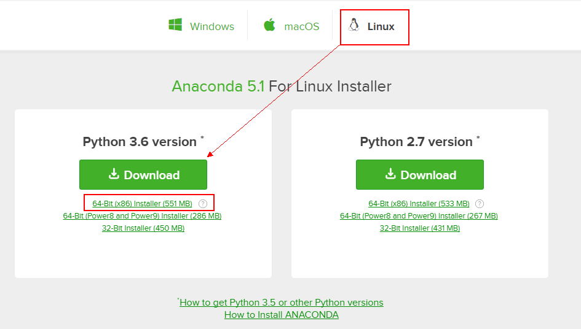

# CentOS6.8安装Anaconda #

## 1、查看服务器的位数 ##

查看服务器是32位，还是64位的，命令如下：

	file /bin/ls

输出为:

	/bin/ls: ELF 64-bit LSB executable, x86-64, version 1 (SYSV), dynamically linked (uses shared libs), for GNU/Linux 2.6.18, stripped

根据输出，可以看到服务器是64位（64-bit）。

## 2、下载Anaconda ##

下载地址：https://www.anaconda.com/download

选择Anaconda的Linux版本，再根据服务器的位数下载64位的文件。

可以执行如下命令下载：

	wget https://repo.anaconda.com/archive/Anaconda3-5.1.0-Linux-x86_64.sh

## 3、安装Anaconda ##

进入Anaconda所在的目录，执行下面的命令：

	bash Anaconda3-5.1.0-Linux-x86_64.sh 

此后依照提示操作即可。最简便的方式就是，让ENTER就ENTER；问yes或no时，就输入yes。

> 说明：在阅读license时，可以按q键退出。
> 后续操作中，三个yes分别代表（1）是否同意license，（2）是否使用默认的安装路径，（3）是否自动向`~/.bashrc`写入PATH路径。

## 4、使配置生效 ##

虽然此时Anaconda已经安装完成，但是当输入`python --version`时，还是会显示`2.6.6`版本，其中的原因就是：虽然安装程序将Anaconda的bin目录，写入到了`~/.bashrc`文件内，但是并没有重新加载该配置文件，因此需要重新加载该配置文件，让配置生效。

执行下述命令使其生效即可

	source ~/.bashrc

> 至此结束。 