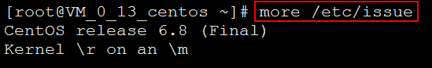
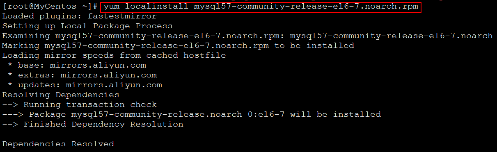
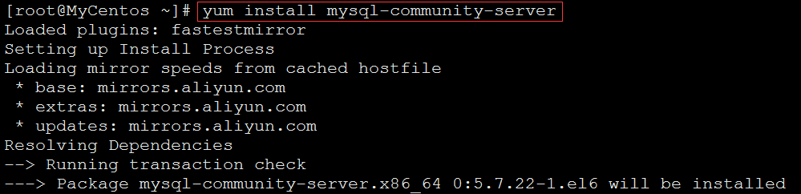
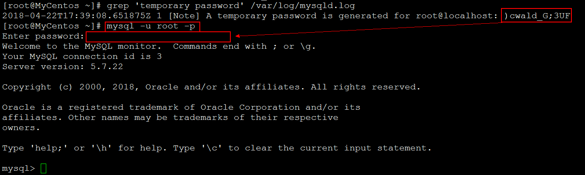
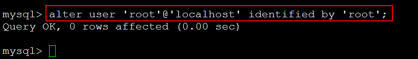
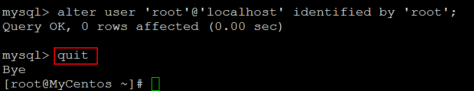
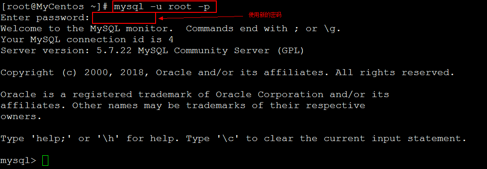
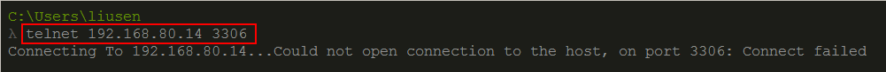
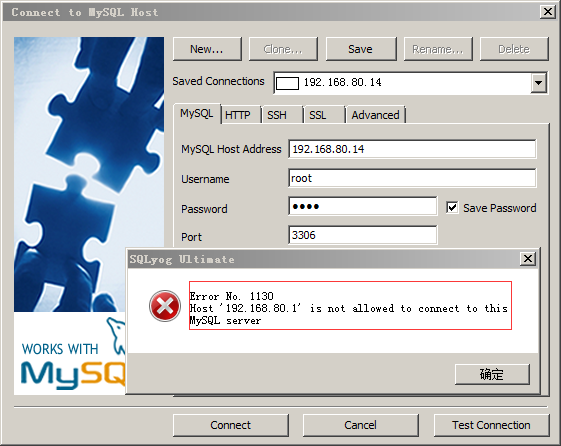

# 安装MySQL5.7 #

## 1、查看Linux版本信息 ##

	more /etc/issue



## 2、安装MySQL ##

	[root@MyCentos ~]# wget http://dev.mysql.com/get/mysql57-community-release-el6-7.noarch.rpm


	[root@MyCentos ~]# yum localinstall mysql57-community-release-el6-7.noarch.rpm



	[root@MyCentos ~]# yum repolist enabled | grep "mysql.*-community.*"


	[root@MyCentos ~]# yum install mysql-community-server



## 3、启动MySQL服务 ##

1、启动MySQL服务（如果没有启动成功，多试几次）。

	[root@MyCentos ~]# service mysqld start
	[root@MyCentos ~]# service mysqld status


2、查看MySQL的版本

	[root@MyCentos ~]# mysql --version


## 4、用root用户登录MySQL ##

1、查看MySQL的默认密码：

	[root@MyCentos ~]# grep 'temporary password' /var/log/mysqld.log


使用默认密码登录MySQL



2、修改MySQL中root用户的密码

	mysql> alter user 'root'@'localhost' identified by 'xxxx';



3、退出MySQL

	mysql> quit



4、重新使用root用户新的密码登录MySQL



## 5、授权root用户可以远程访问 ##

1、查看MySQL服务监听的端口(3306)：

	[root@MyCentos ~]# netstat -nltp
	或者
	[root@MyCentos ~]# netstat -nltp | grep mysql


2、从另外一台电脑上使用`telnet`命令查看Linux的服务器的3306端口是否打开

	telnet 192.168.80.14 3306



3、开启Linux服务器的3306端口

修改/etc/sysconfig/iptables文件

	[root@MyCentos ~]# vi /etc/sysconfig/iptables

添加如下内容

	-A INPUT -m state --state NEW -m tcp -p tcp --dport 3306 -j ACCEPT


重启防火墙

	service iptables restart


4、授权root用户可以远程访问

在另一台电脑上登录MySQL，得到如下提示：



在MySQL上进行查询操作：

	mysql> SELECT User, Host FROM mysql.user;


在Linux服务器上进行如下操作：

	mysql> GRANT ALL PRIVILEGES ON *.* TO 'root'@'%' IDENTIFIED BY '123456' WITH GRANT OPTION;


	mysql> flush privileges;

这样，在另一台电脑上，就可以远程访问了。

## 6、配置MySQL的字符集编码 ##

在Linux上，需要编辑MySQL的配置文件，把数据库默认的编码全部改为`UTF-8`。MySQL的配置文件默认存放在`/etc/my.cnf`或者`/etc/mysql/my.cnf`：

```
[client]
default-character-set = utf8

[mysqld]
default-storage-engine = INNODB
character-set-server = utf8
collation-server = utf8_general_ci
```

>注：如果MySQL的版本≥5.5.3，可以把编码设置为`utf8mb4`。`utf8mb4`和`utf8`完全兼容，但它（`utf8mb4`）支持最新的Unicode标准，可以显示emoji字符。

```
[client]
default-character-set = utf8mb4

[mysqld]
default-storage-engine = INNODB
character-set-server = utf8mb4
collation-server = utf8mb4_general_ci
```

重启MySQL后，可以通过MySQL的客户端命令行检查编码：

```
$ mysql -u root -p
Enter password: 
Welcome to the MySQL monitor...
...

mysql> show variables like '%char%';
+--------------------------+----------------------------+
| Variable_name            | Value                      |
+--------------------------+----------------------------+
| character_set_client     | utf8mb4                    |
| character_set_connection | utf8mb4                    |
| character_set_database   | utf8mb4                    |
| character_set_filesystem | binary                     |
| character_set_results    | utf8mb4                    |
| character_set_server     | utf8mb4                    |
| character_set_system     | utf8                       |
| character_sets_dir       | /usr/share/mysql/charsets/ |
+--------------------------+----------------------------+
8 rows in set (0.01 sec)
```

看到`utf8`字样就表示编码设置正确。


## 7、添加用户与授权 ##

1、为用户授权

授权格式：

```mysql
grant 权限 on 数据库.* to 用户名@登录主机 identified by "密码";
```

```mysql
mysql>create database testDB;
mysql>grant all privileges on testDB.* to test@localhost identified by '123123';
mysql>flush privileges;//刷新系统权限表
```

>注意：此处的"localhost"，是指该用户只能在本地登录，不能在另外一台机器上远程登录。如果想远程登录的话，将"localhost"改为"%"，表示在任何一台电脑上都可以登录。也可以指定某台机器可以远程登录。

```
grant select,delete,update,create,drop on *.* to test@"%" identified by "1234";
```

其中，`@"%"` 表示对所有非本地主机授权，不包括localhost。（localhost地址设为127.0.0.1，如果设为真实的本地地址，不知道是否可以，没有验证。）

2、添加数据表

```mysql
mysql> mysql -u test -p
Enter password: 

mysql> use testDB;

Database changed
mysql> create table `tb_book`(
    -> book_id INT NOT NULL AUTO_INCREMENT,
    -> book_title VARCHAR(128) NOT NULL,
    -> book_author VARCHAR(32) NOT NULL,
    -> publish_date DATE NOT NULL,
    -> PRIMARY KEY(`book_id`)
    -> );
Query OK, 0 rows affected (0.03 sec)
```

> 至此结束。
