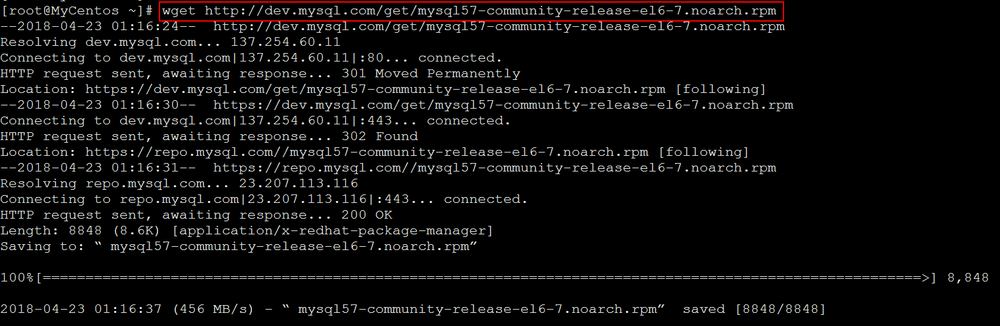
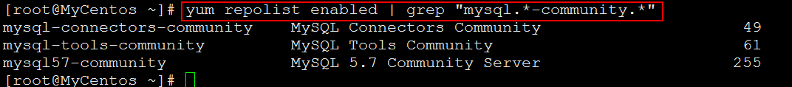
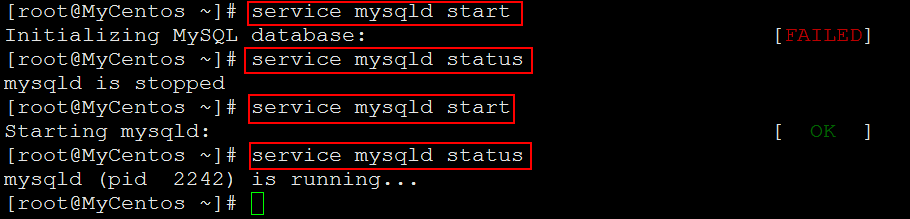
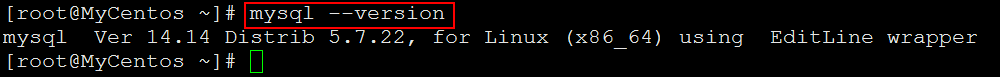
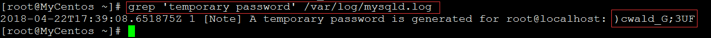
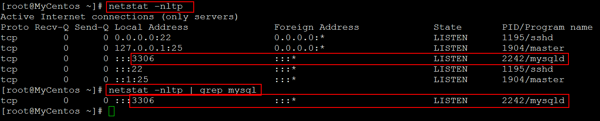
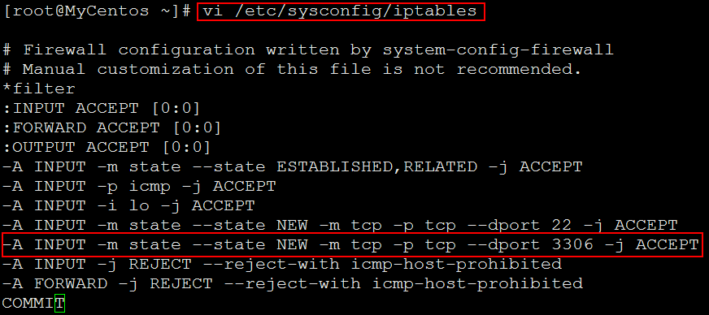
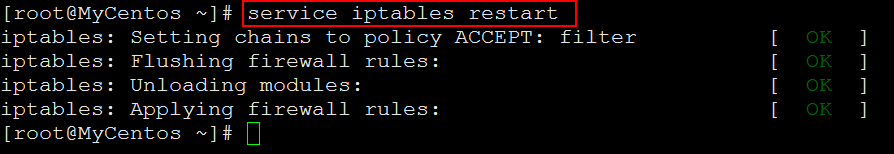
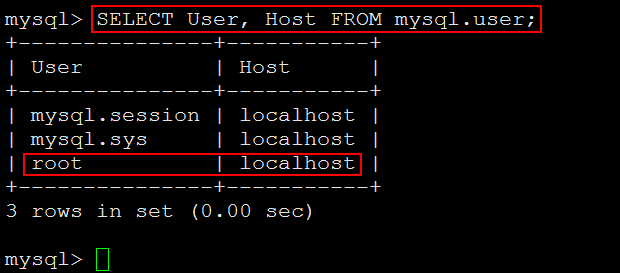

# 安装MySQL5.7 #

## 1、查看Linux版本信息 ##

	more /etc/issue

## 2、安装MySQL ##

	[root@MyCentos ~]# wget http://dev.mysql.com/get/mysql57-community-release-el6-7.noarch.rpm

	[root@MyCentos ~]# yum localinstall mysql57-community-release-el6-7.noarch.rpm

	[root@MyCentos ~]# yum repolist enabled | grep "mysql.*-community.*"

	[root@MyCentos ~]# yum install mysql-community-server

## 3、启动MySQL服务 ##

1、启动MySQL服务（如果没有启动成功，多试几次）。

	[root@MyCentos ~]# service mysqld start
	[root@MyCentos ~]# service mysqld status

2、查看MySQL的版本

	[root@MyCentos ~]# mysql --version

## 4、用root用户登录MySQL ##

1、查看MySQL的默认密码：

	[root@MyCentos ~]# grep 'temporary password' /var/log/mysqld.log

使用默认密码登录MySQL

2、修改MySQL中root用户的密码

	mysql> alter user 'root'@'localhost' identified by 'xxxx';

3、退出MySQL

	mysql> quit

4、重新使用root用户新的密码登录MySQL

## 5、授权root用户可以远程访问 ##

1、查看MySQL服务监听的端口(3306)：

	[root@MyCentos ~]# netstat -nltp
	或者
	[root@MyCentos ~]# netstat -nltp | grep mysql

2、从另外一台电脑上使用`telnet`命令查看Linux的服务器的3306端口是否打开

	telnet 192.168.80.14 3306

3、开启Linux服务器的3306端口

修改/etc/sysconfig/iptables文件

	[root@MyCentos ~]# vi /etc/sysconfig/iptables

添加如下内容

	-A INPUT -m state --state NEW -m tcp -p tcp --dport 3306 -j ACCEPT

重启防火墙

	service iptables restart

4、授权root用户可以远程访问

在另一台电脑上登录MySQL，得到如下提示：

在MySQL上进行查询操作：

	mysql> SELECT User, Host FROM mysql.user;

在Linux服务器上进行如下操作：

	mysql> GRANT ALL PRIVILEGES ON *.* TO 'root'@'%' IDENTIFIED BY '123456' WITH GRANT OPTION;

这样，在另一台电脑上，就可以远程访问了。

> 至此结束。
