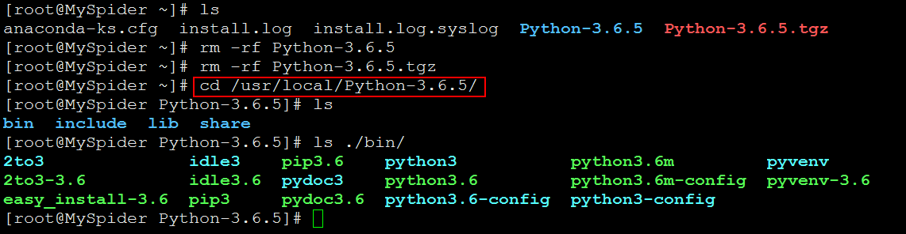

# Python3环境安装 #

## 1、环境检查 ##

### 1.1、检查Python情况 ###

	[root@MySpider ~]# rpm -qa | grep python

或者使用如下命令，查看python的详细信息：

	[root@MySpider ~]# yum info python

我们可以看到，当前Python的版本是 2.6.6。而我们想要安装的Python版本是3.6.5。

### 1.2、检查gcc情况 ###

在Linux上安装Python3的时候，是使用Python3的source code进行安装；而Python3的source code需要先进行编译之后，才能进行安装。

	[root@MySpider ~]# rpm -qa | grep gcc

## 2、下载Python源码 ##

第一步：打开Python官网

	https://www.python.org/

第二步：选择Downloads-->Source Code

第三步：选择Python 3.6.5的版本下载

	[root@MySpider ~]# wget https://www.python.org/ftp/python/3.6.5/Python-3.6.5.tgz

第四步：解压Python-3.6.5.tgz （可以自由浏览里面的内容，查看源码）

	[root@MySpider ~]# tar -zxvf Python-3.6.5.tgz

第五步：进入解压后的目录Python-3.6.5（可以自由查看文件）

	[root@MySpider ~]# cd Python-3.6.5

## 3、编译环境准备和依赖包安装 ##

### 3.1、编译环境准备 ###

由于下载的是源码，需要我们自己进行手动编译和手动安装。我们使用的编译器就是gcc。

第一步：查看是否安装了gcc

	[root@MySpider ~]# rpm -qa | grep gcc

第二步：安装gcc，使用如下命令：

	[root@MySpider ~]# yum -y install gcc

或者（gcc-c++可以对c++代码进行编译）

	[root@MySpider ~]# yum -y install gcc gcc-c++

第三步：再次查看gcc安装情况

	[root@MySpider ~]# rpm -qa | grep gcc

### 3.2、安装pip的依赖包 ###

python的pip需要依赖于zlib和openssl。使用yum安装：

	[root@MySpider ~]# yum -y install zlib* openssl*

## 4、预编译 ##

第一步：切换到Python 3.6.5的解压目录

	[root@MySpider ~]# cd ~/Python-3.6.5
	[root@MySpider Python-3.6.5]# ls

第二步：使用configure命令进行配置

	[root@MySpider Python-3.6.5]# ./configure --prefix=/usr/local/Python-3.6.5

在结尾处，我们看到提示，建议我们使用`--enable-optimizations`。

因此，再重新执行一下configure命令：

	[root@MySpider Python-3.6.5]# ./configure --prefix=/usr/local/Python-3.6.5 --enable-optimizations

./configure --enable-optimizations

> configure文件就是预编译的文件。
> 其中--prefix参数就是指定安装目录（这个目录如果之前不存在，就会自动创建）。
> 另外，rpm文件安装不能指定安装目录，只有源码安装才能指定目录。
> 可以通过 `./configure --help`查看configure的用法。

## 5、编译 ##

编译命令如下：

	[root@MySpider Python-3.6.5]# make

> 注意：“预编译”时间不会长，但“编译”时间会比较长：VMWare 内存1GB，CentOS6.8的虚拟机耗时15分钟。

## 6、安装 ##

安装命令如下：

	[root@MySpider Python-3.6.5]# make install

> 注意：安装完成之后，就可以将压缩包(Python-3.6.5.tgz)和解压后的目录(Python-3.6.5)删除掉了。“安装”时间，大概花费2分钟。

安装完成后，删除压缩包(Python-3.6.5.tgz)和解压后的目录(Python-3.6.5)

	[root@MySpider ~]# rm -rf Python-3.6.5
	[root@MySpider ~]# rm -rf Python-3.6.5.tgz

切换到Python3的安装目录：

	[root@MySpider ~]# cd /usr/local/Python-3.6.5/

同时，我们可以看到Python安装目录下的bin目录中有许多绿色的可执行文化。

## 7、配置Python环境变量 ##

### 7.1、查看环境变量 ###

查看环境变量的命令如下：

	[root@MySpider ~]# printenv
	[root@MySpider ~]# printenv | grep PATH

一个命令之所以能够执行，就是因为该命令处于系统的环境变量之中。我们也可以通过`which`和`whereis`命令查看软件的安装位置。

	[root@MySpider ~]# which python
	[root@MySpider ~]# whereis python
	[root@MySpider ~]# which cp
	[root@MySpider ~]# whereis cp

当我们输入`python3`命令的时候，会提示command not found，是因为`python3`并没有存在于PATH路径中。

### 7.2配置Python环境变量 ###

第一步：编辑`~/.bashrc`文件

	[root@MySpider ~]# vim ~/.bashrc

第二步：在文件末尾添加如下内容：

	PYTHON_HOME=/usr/local/Python-3.6.5
	PATH=$PATH:$PYTHON_HOME/bin

第三步：使用`source`命令，使配置生效

	[root@MySpider ~]# source ~/.bashrc

第四步：使用`python3`命令进行验证

	[root@MySpider ~]# python3 --version

> 注意：
> `/etc/profile` 表示整个系统的环境变量配置
> `~/.bashrc` 表示当前用户的环境变量配置

## 8、配置pip镜像 ##

### 8.1、临时使用 ###
可以在使用pip的时候加参数`-i https://pypi.tuna.tsinghua.edu.cn/simple`。例如：

	pip install -i https://pypi.tuna.tsinghua.edu.cn/simple gevent

这样就会从清华这边的镜像去安装gevent库。

### 8.2、永久修改 ###
Linux下，修改 `~/.pip/pip.conf` (没有就创建一个)， 修改 index-url至tuna，内容如下：

	[global]
	index-url = https://pypi.tuna.tsinghua.edu.cn/simple

windows下，直接在user目录中创建一个pip目录，如：C:\Users\xxx\pip，新建文件pip.ini，内容如下

	[global]
	index-url = https://pypi.tuna.tsinghua.edu.cn/simple

### 8.3、实践：Linux下修改pip镜像源 ###

第一步：使用`vim`命令编辑`~/.pip/pip.conf`文件

	[root@MySpider ~]# cd ~
	[root@MySpider ~]# mkdir .pip
	[root@MySpider ~]# cd .pip/
	[root@MySpider .pip]# touch pip.conf
	[root@MySpider .pip]# cd ~
	[root@MySpider ~]# vim ~/.pip/pip.conf

第二步，添加如下内容：

	[global]
	index-url = https://pypi.tuna.tsinghua.edu.cn/simple

第三步：安装ipython

	[root@MySpider ~]# pip3 install ipython

第四步：切换到Python的安装目录，可以看到多了ipython文件

	[root@MySpider ~]# cd /usr/local/Python-3.6.5/
	[root@MySpider Python-3.6.5]# ls ./bin/

> 至此结束。
