# 编译程序 #

## 1. make命令 ##

命令`make`是维护程序的工具

## 2. 基本步骤 ##

1. 安装编译器
2. 获取源代码
3. 查看代码
4. 编译预处理
5. 编译程序
6. 安装程序

## 3. 案例：compile diction ##

steps as follows:

### 3.1 install software ###

需要使用到的软件有：

	make, ftp, gcc

make软件已经存在，不需要安装：

	[root@mini ~]# which make
	/usr/bin/make

	[root@mini ~]# which ftp
	/usr/bin/which: no ftp in (/usr/local/sbin:/usr/local/bin:/sbin:/bin:/usr/sbin:/usr/bin:/root/bin)

	[root@mini ~]# which gcc
	/usr/bin/which: no gcc in (/usr/local/sbin:/usr/local/bin:/sbin:/bin:/usr/sbin:/usr/bin:/root/bin)

安装ftp和gcc软件的命令如下：

	yum -y install ftp gcc

### 3.2 get source code ###

使用ftp软件连接到ftp.gnu.org

	ftp ftp.gnu.org

在Name处输入annonymous

	Name (ftp.gnu.org:xxx):  # 此处输入anonymous

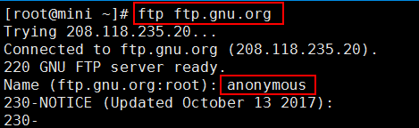

使用ls命令查看ftp的目录内容：

	ftp> ls #查看目录内容

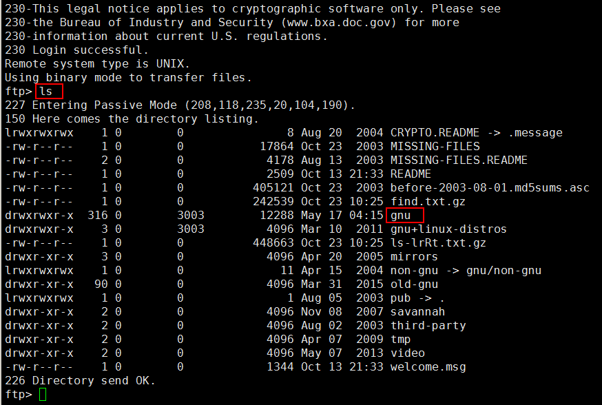

使用cd命令切换到gnu/diction目录下，并查看目录内容：

	ftp> cd gnu/diction #切换到gnu/diction目录下
	ftp> ls # 查看目录内容

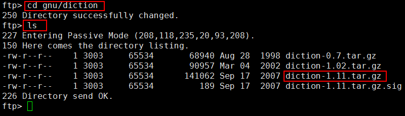

使用get命令下载最新diction软件包

	ftp> get diction-1.11.tar.gz #获取最新版本的文件

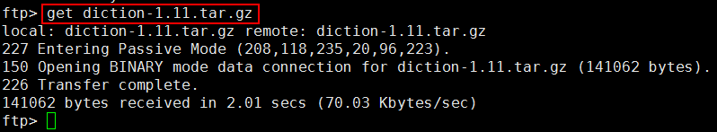

使用bye命令退出ftp：

	ftp> bye #退出ftp

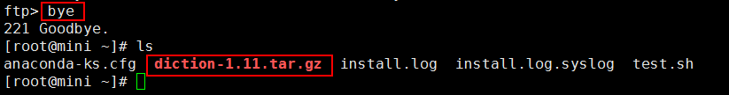

### 3.3 view code ###

解压diction-1.11.tar.gz

	tar -zxvf diction-1.11.tar.gz -C /usr/local/ # 解压
	cd /usr/local/diction-1.11/ # 切换到目标文件夹
	ls   # 查看目录内容

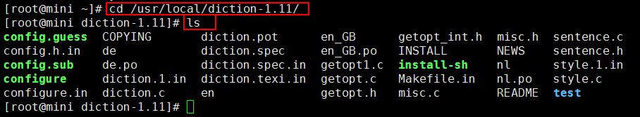

我们感兴趣的文件是：*.c和*.h的文件

	ls *.c #查看后缀名为“.c”的文件
	ls *.h #查看头文件

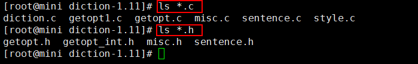

下面是编译源代码的主要三个步骤：
第一步：预编译，做好准备工作
第二步：正式编译
第三步：把编译好的软件安装上

### 3.4 prepare ###

预编译的准备工作是执行一下configure程序。（注：一般gnu下的程序都有configure脚本。

	./configure

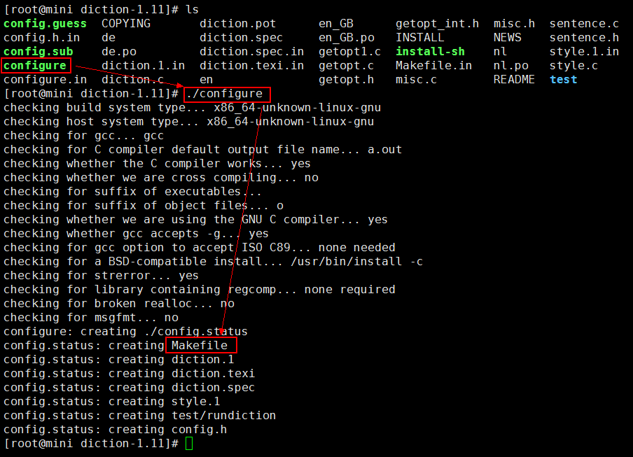

最后会创建Makefile文件，有了Makefile文件就可以进行make编译操作了。这样就把编译的准备工作做好。

### 3.5 compile ###

Makefile也是一个脚本文件。执行make命令：

	make

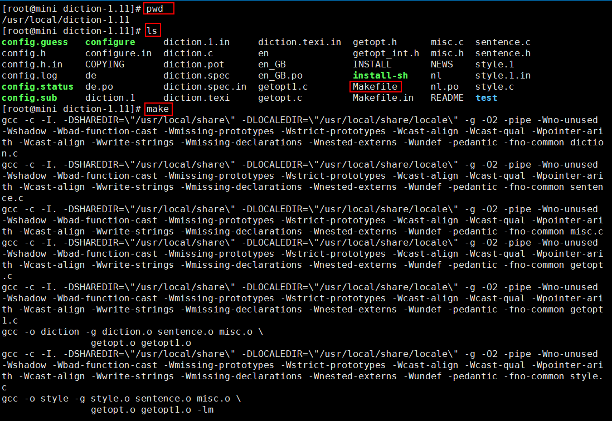

### 6. install ###

最后就是安装命令：

	make install

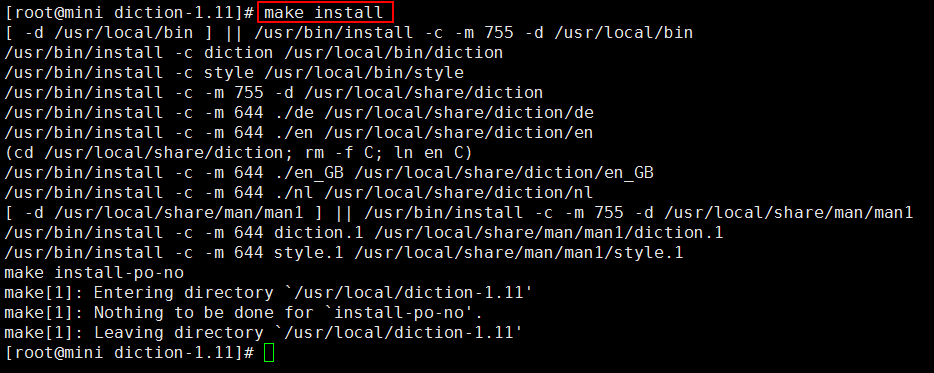

验证是否安装成功：

	which diction

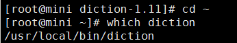

> 至此结束。